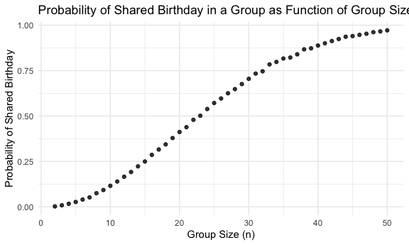
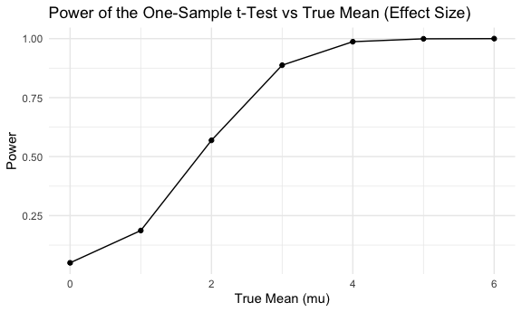
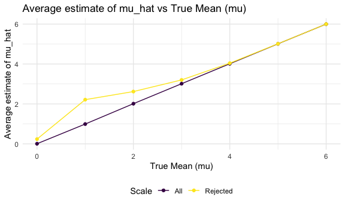

p8105_hw5_zg2486
================
2024-11-05

# Question1

``` r
birthday = function(n) {

  bdays = sample(1:365, size = n, replace = TRUE)
  
  duplicate = length(unique(bdays)) < n

  return(duplicate)
}

sim_bday = 
  expand_grid(
    n = 2:50,
    iter = 1:10000
  ) %>% 
  mutate(probability = map(n, birthday)) %>% 
  unnest(probability) %>% 
  group_by(n) %>% 
  summarise(average_prob = mean(probability))

sim_bday %>% 
  ggplot(aes(x = n, y = average_prob)) +
  geom_point(alpha = 0.8) +
  labs(
    title = "Probability of Shared Birthday in a Group as Function of Group Size",
    x = "Group Size (n)",
    y = "Probability of Shared Birthday"
  ) 
```


From the plot, we can see the probability that at least two people in
the group will share a birthday by averaging across the 10000 simulation
runs increases as the sample group size become larger.

# Question 2

``` r
library(broom)
sim_mean_sd = function(n = 30, mu, sigma = 5) {
  
  sim_df = 
    tibble(
      x = rnorm(n, mean = mu, sd = sigma)
    )

  t_test_result = t.test(pull(sim_df, x), mu = 0) %>% 
    tidy()

  out_df = 
    sim_df %>%  
    summarize(
      mu_hat = mean(x),
      p_value = pull(t_test_result, p.value)
    )
  
  return(out_df)
}

sim_data = 
  expand_grid(
    mu = 0:6,
    iter = 1:5000
  ) %>% 
  mutate(reject_null = map(mu, sim_mean_sd, n = 30)) %>% 
  unnest(reject_null)
```

### Plot for Power vs True Mean.

``` r
power_plot = 
  sim_data %>% 
  group_by(mu) %>% 
  summarise(power = mean(p_value < 0.05)) %>% 
  ggplot(aes(x = mu, y = power)) + 
  geom_point() +
  geom_line() +
  labs(
    title = "Power of the One-Sample t-Test vs True Mean (Effect Size)",
    x = "True Mean (mu)",
    y = "Power"
  )

power_plot
```


The plot shows that power increases as the true mean (𝜇) increases,
because as the true effect size (difference between the null hypothesis
value and the true mean) becomes larger, it becomes easier to detect the
effect, resulting in higher power.

### Plot of Average estimates of 𝜇̂and 𝜇̂ only in samples for which the null was rejected vs True mean

``` r
average_mu_hat = 
  sim_data %>% 
  group_by(mu) %>% 
  summarise(
    avg_mu_hat = mean(mu_hat),
    avg_mu_hat_reject = mean(mu_hat[p_value < 0.05])
    ) %>% 
  ggplot(aes(x = mu)) + 
  geom_point(aes(y = avg_mu_hat, color = "All")) +
  geom_line(aes(y = avg_mu_hat, color = "All")) +
  geom_point(aes(y = avg_mu_hat_reject, color = "Rejected")) +
  geom_line(aes(y = avg_mu_hat_reject, color = "Rejected")) +
  labs(
    title = "Average estimate of mu_hat vs True Mean (mu)",
    x = "True Mean (mu)",
    y = "Average estimate of mu_hat",
    color = "Scale"
  )

average_mu_hat
```


The average estimate of 𝜇̂ across tests for which the null is rejected is
not equal to the true mean (mu) when effect size is small, because

# Question 3

``` r
homicide_df = 
  read_csv("./data/homicide-data.csv") %>% 
  mutate(
    city_state = str_c(city, state, sep = ","),
    resolution = case_when(
      disposition == "Closed without arrest" ~ "unsolved",
      disposition == "Open/No arrest"        ~ "unsolved",
      disposition == "Closed by arrest"      ~ "solved")
  ) %>%
  filter(city_state != "Tulsa,AL")
```

    ## Rows: 52179 Columns: 12
    ## ── Column specification ────────────────────────────────────────────────────────
    ## Delimiter: ","
    ## chr (9): uid, victim_last, victim_first, victim_race, victim_age, victim_sex...
    ## dbl (3): reported_date, lat, lon
    ## 
    ## ℹ Use `spec()` to retrieve the full column specification for this data.
    ## ℹ Specify the column types or set `show_col_types = FALSE` to quiet this message.

``` r
homicide_by_states =
  homicide_df %>% 
  group_by(city_state) %>% 
  summarise(
    total_homicides = n(),
    unsolved_homicides = sum(resolution == "unsolved")
  )
```

The raw data is relatively completed, with few missing value. I noticed
that there is a city “Tulsa” that exist in 2 states, therefore, I will
analyze the data for each city based on the new created variable
`city_state`. And there is only 1 observation in “Tulsa, AL”, so I will
drop this.

### Estimate the proportion of homicides that are unsolved for city of Baltimore, MD

``` r
prop.test(
  homicide_by_states %>% filter(city_state == "Baltimore,MD") %>% pull(unsolved_homicides), 
  homicide_by_states %>% filter(city_state == "Baltimore,MD") %>% pull(total_homicides)) %>%
  broom::tidy() %>% 
  knitr::kable()
```

| estimate | statistic | p.value | parameter | conf.low | conf.high | method | alternative |
|---:|---:|---:|---:|---:|---:|:---|:---|
| 0.6455607 | 239.011 | 0 | 1 | 0.6275625 | 0.6631599 | 1-sample proportions test with continuity correction | two.sided |
