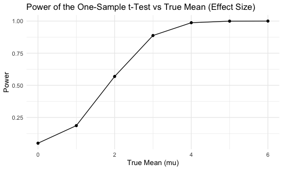

p8105_hw5_zg2486
================
2024-11-05

# Question1

``` r
birthday = function(n) {

  bdays = sample(1:365, size = n, replace = TRUE)
  
  duplicate = length(unique(bdays)) < n

  return(duplicate)
}

sim_bday = 
  expand_grid(
    n = 2:50,
    iter = 1:10000
  ) %>% 
  mutate(probability = map(n, birthday)) %>% 
  unnest(probability) %>% 
  group_by(n) %>% 
  summarise(average_prob = mean(probability))

sim_bday %>% 
  ggplot(aes(x = n, y = average_prob)) +
  geom_point(alpha = 0.8) +
  labs(
    title = "Probability of Shared Birthday in a Group as Function of Group Size",
    x = "Group Size (n)",
    y = "Probability of Shared Birthday"
  ) 
```


From the plot, we can see the probability that at least two people in
the group will share a birthday by averaging across the 10000 simulation
runs increases as the sample group size become larger.

# Question 2

``` r
library(broom)
sim_mean_sd = function(n = 30, mu, sigma = 5) {
  
  sim_df = 
    tibble(
      x = rnorm(n, mean = mu, sd = sigma)
    )

  t_test_result = t.test(pull(sim_df, x), mu = mu) %>% 
    tidy()

  out_df = 
    sim_df %>%  
    summarize(
      mu_hat = mean(x),
      p_value = pull(t_test_result, p.value)
    )
  
  return(out_df)
}

sim_data = 
  expand_grid(
    mu = 0:6,
    iter = 1:5000
  ) %>% 
  mutate(reject_null = map(mu, sim_mean_sd, n = 30)) %>% 
  unnest(reject_null)

power_plot = 
  sim_data %>% 
  group_by(mu) %>% 
  summarise(power = mean(p_value < 0.05)) %>% 
  ggplot(aes(x = mu, y = power)) + 
  geom_point() +
  geom_line() +
  labs(
    title = "Power of the One-Sample t-Test vs True Mean (Effect Size)",
    x = "True Mean (mu)",
    y = "Power"
  )

power_plot
```



``` r
average_mu_hat = 
  sim_data %>% 
  group_by(mu) %>% 
  summarise(avg_mu_hat = mean(mu_hat)) %>% 
  ggplot(aes(x = mu, y = avg_mu_hat)) + 
  geom_point() +
  geom_line() +
  labs(
    title = "Average estimate of mu_hat vs True Mean (mu)",
    x = "True Mean (mu)",
    y = "Average estimate of mu_hat"
  )

average_mu_hat
```


``` r
average_mu_hat_reject = 
  sim_data %>% 
  filter(p_value < 0.05) %>% 
  group_by(mu) %>% 
  summarise(avg_mu_hat_reject = mean(mu_hat)) %>% 
  ggplot(aes(x = mu, y = avg_mu_hat_reject)) + 
  geom_point() +
  geom_line() +
  labs(
    title = "Average estimate of mu_hat that reject null vs True Mean (mu)",
    x = "True Mean (mu)",
    y = "Average estimate of mu_hat that reject null"
  )

average_mu_hat_reject
```


